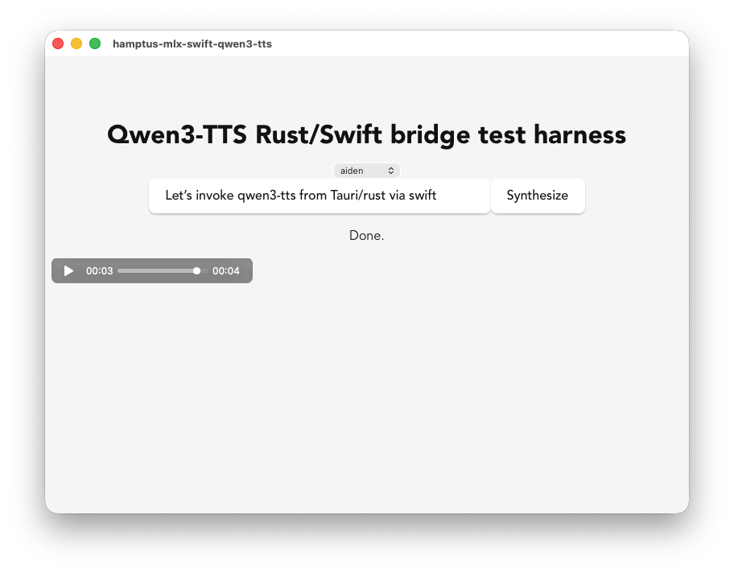

# Qwen3-TTS Tauri Prototype

  

  

This is a prototyping repo to get [Qwen3-TTS](https://github.com/QwenLM/Qwen3-TTS) running from a Tauri2 desktop app, since I am planning to integrate this into the language learning app I'm building: [Fluensy](https://fluensy.app)

Right now I mainly need it on macOS, so there is a heavy bias towards that platform. 

## P0 Requirements

1. Supports Qwen3-TTS
2. Runs on macOS
3. Streams audio rather than waiting for the full clip to render

## P1 Requirements

1. Other LLM/TTS models

## Supported approaches

Still evaluating. See design notes below.

## Design notes - best integration strategy?

### Option 1: llama.cpp native integration via FFI

This is the approach used for Gemma 4 in a sibling prototype ([tauri2-local-llm](https://github.com/tleyden/tauri2-local-llm)), and it's been working well there.

#### Risks

1. llama.cpp does not yet support Qwen3-TTS — there's an open issue tracking support. Until that lands, this option is blocked for this project.

### Option 2: mlx-swift-qwen3-tts (hamptus) - implemented via Swift/MLX bridge

Repo: [hamptus/mlx-swift-qwen3-tts](https://github.com/hamptus/mlx-swift-qwen3-tts)

Local implementation: [hamptus-mlx-swift-qwen3-tts](./hamptus-mlx-swift-qwen3-tts) and [qwen3-tts-swift-rs](./qwen3-tts-swift-rs)

This one has substantially more visibility than the alternative below. The author first posted an iPhone demo to r/LocalLLaMA, where people tested it on Macs and iPhones, and that thread became the announcement for the Swift package. That's a positive signal because multiple users tested it, reported bugs, the author replied, and improvements came out of community feedback. It feels like a real project instead of just a code dump.

#### Strengths

1. Actually streams PCM audio chunks (not just streamed tokens followed by one final audio blob)
2. Better SDK ergonomics: `generateToFile()`, `AudioSampleWriter`, `StreamingWAVWriter`
3. Already solves long-form generation: chunking, crossfade, long-form text
4. API feels more like a polished Apple framework than research code

#### Risks

1. More complicated toolchain than a pure Rust/FFI approach (Swift + MLX)
2. Would need a Rust <-> Swift bridge to call from a Tauri2 (Rust) backend

### Option 3: swift-qwen3-tts (AtomGradient)

Repo: [AtomGradient/swift-qwen3-tts](https://github.com/AtomGradient/swift-qwen3-tts)

Academically stronger than hamptus's project, but with much less community testing — I couldn't find any Reddit discussion of it. What I did find: the GitHub repo, its accompanying compression paper, and a post from the same author showing on-device Qwen3-TTS with MLX-Swift.

#### Strengths

1. Architecture is explicitly documented: Tokenizer → Talker → Code Predictor → Speech Tokenizer → Audio, which suggests the author understands the model rather than just wrapping it
2. Published a paper covering compression work: vocabulary pruning, tokenizer pruning, quantization
3. API (`Qwen3TTSModel`) feels closer to raw MLX than a `Pipeline`-style wrapper, which usually means less framework overhead
4. Exposes generation controls directly: top-k, top-p, repetition penalty, language, temperature

#### Risks

1. No real streaming yet — the README says final audio is still delivered as a single `MLXArray`, i.e. token-by-token generation followed by one final audio blob, not streamed audio chunks. That's a significant limitation for Fluensy.
2. Requires manually copying `default.metallib` — unclear why, whether it's temporary, or whether it complicates packaging inside a Tauri app
3. Same toolchain and Rust <-> Swift bridging concerns as Option 2

### Option 4: mlx-rs

#### Risks

1. Would need to confirm Qwen3-TTS model support directly in mlx-rs rather than going through a Swift wrapper

